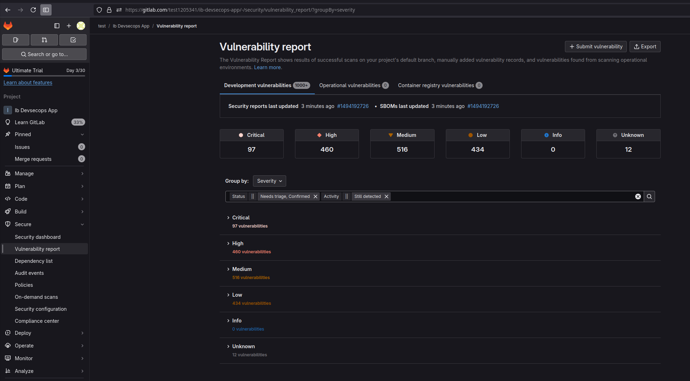
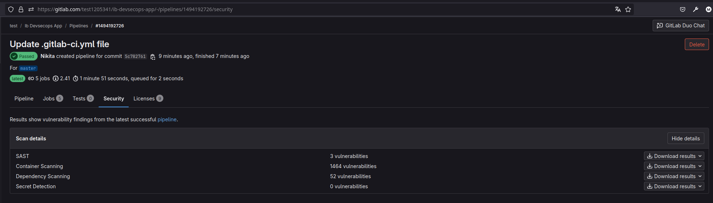
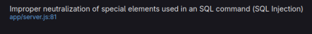
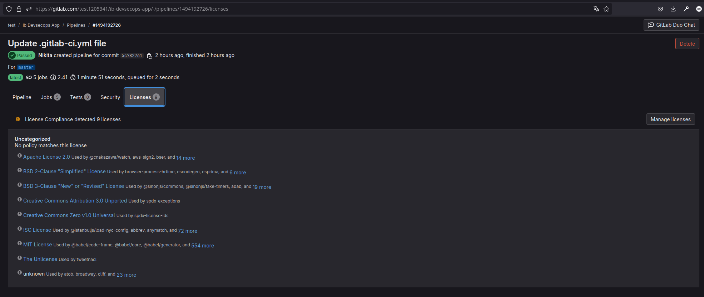

# 03_devsecops

## Задание GitLab
### 1. Сколько уязвимостей и какого уровня значимости найдено (Severity)?

### 2. Сколько из них:
* в самом приложении (SAST);
* в контейнерах (Container Scanning);
* в зависимостях (Dependency Scanning);
* секретов (Secret Detection)?

### 3. Какая уязвимость найдена в самом приложении?

### 4. Сколько зависимостей в приложении?
1121 зависемых либ node.js

### 5. Сколько различного рода лицензий используется в приложении и его зависимостях?

